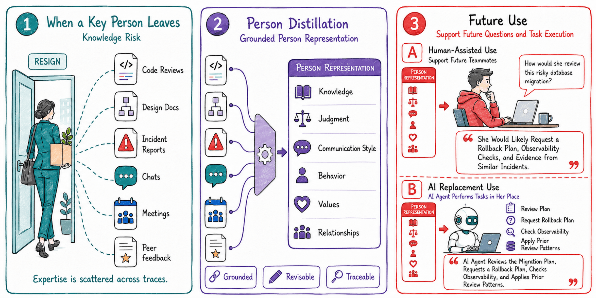
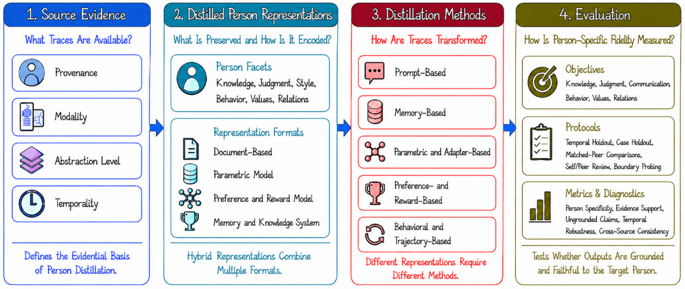
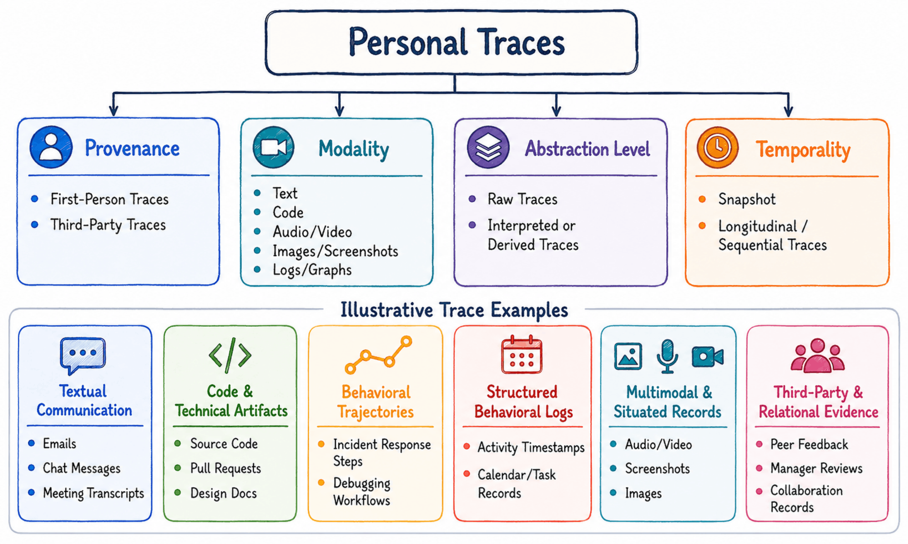
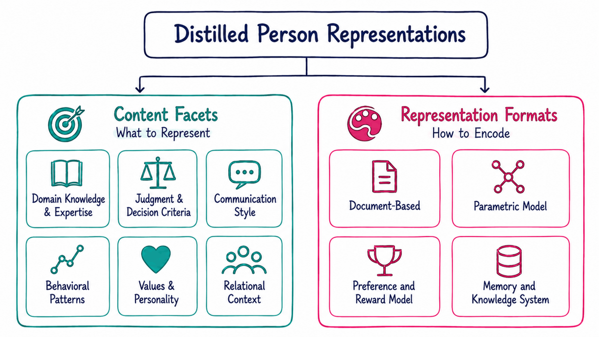
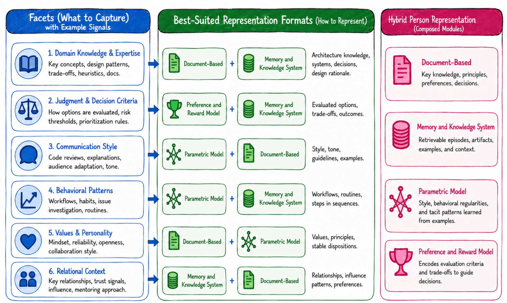
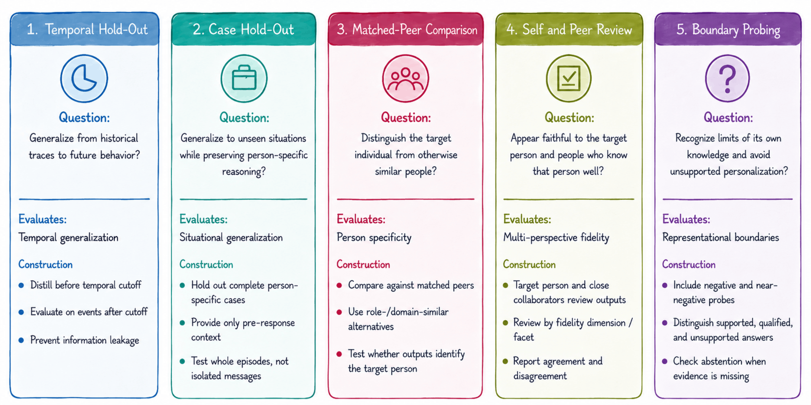

# Person Distillation: Foundations and Principles for Personalized AI

**Minxing Zhang\***, **Yi Yang\***, and **Jian Pei**  
Duke University  

\* Equal contribution.

Person distillation is the process of transforming heterogeneous traces of a particular real person into evidence-grounded, person-specific, and revisable computational representations for specified uses. These representations may preserve the person's domain knowledge and expertise, judgment and decision criteria, communication style, behavioral patterns, values and personality, and relational context.

[PDF](./Person_Distillation__Foundations_and_Principles_for_Personalized_AI.pdf) · [Cite](./cite.bib)

<p align="center">
  
</p>

<p align="center">
  <em>
    Person distillation transforms heterogeneous traces of a particular real person into evidence-grounded and revisable representations that can support future collaborators or guide AI agents in bounded, person-specific tasks.
  </em>
</p>

## Overview

Person distillation is organized as an end-to-end lifecycle with four tightly coupled components: source evidence, distilled person representations, distillation methods, and evaluation. The available evidence determines which person-specific claims can be supported; the facets to be preserved shape the appropriate representation; the representation influences the distillation method; and evaluation determines whether the resulting representation faithfully captures the intended person while recognizing the limits of the available evidence.

### 1. What Is Person Distillation?

Person distillation goes beyond conventional personalization. Personalization typically adapts an AI system to a user's information, preferences, or communication style. Person distillation instead begins with heterogeneous evidence about a particular real person and seeks to construct a faithful computational representation of that individual's knowledge, judgment, communication, behavior, values, personality, and relationships.

Faithfully representing a person is also different from merely imitating one. A system may reproduce someone's writing style while failing to preserve their expertise, make technically correct decisions that differ from the person's judgment, or invent unsupported preferences, experiences, or decision rules. Person distillation therefore asks three fundamental questions:

- What information about the person is supported by the available evidence?
- What makes that information specific to the individual rather than their general role?
- When should the system acknowledge that the evidence is insufficient?

<p align="center">
  
</p>

<p align="center">
  <em>
    Person distillation is organized as a coupled lifecycle from source evidence to distilled person representations, distillation methods, and evaluation.
  </em>
</p>

| Lifecycle component | Central question |
| --- | --- |
| Source evidence | What personal traces are available, and what claims can they support? |
| Distilled person representations | What facets of the person should be preserved, and how should they be represented? |
| Distillation methods | How should heterogeneous traces be transformed into person-specific representations? |
| Evaluation | How can we determine whether the representation faithfully captures the target person? |

### 2. What Counts as Source Evidence?

Person distillation begins with source evidence. We define **personal traces** as observable evidence from which a person's knowledge, skills, preferences, personality, relationships, and behavioral patterns can be inferred. These traces may include first-person artifacts such as messages, emails, code commits, authored documents, meeting recordings, social media posts, and activity logs, as well as third-party artifacts such as peer evaluations, performance reviews, media reports, and conversations about the target person.

The available evidence defines the boundary of what can be responsibly distilled. A system trained only on chat messages may imitate communication style but fail to recover technical judgment. A system trained only on task trajectories may capture reusable skills while missing the person-specific reasoning behind them.

<p align="center">
  
</p>

<p align="center">
  <em>
    Personal traces are organized along four complementary dimensions: provenance, modality, abstraction level, and temporality.
  </em>
</p>

| Dimension | Central question | Examples |
| --- | --- | --- |
| Provenance | Who generated the trace? | First-person traces; third-party traces. |
| Modality | How is the trace expressed and organized? | Text, speech, video, images, code, behavioral logs, task trajectories, and relational graphs. |
| Abstraction level | How much interpretation has already been applied? | Raw traces; interpreted or derived traces. |
| Temporality | When was the trace generated, and is its temporal structure preserved? | Snapshot traces; longitudinal or sequential traces. |

These dimensions are complementary rather than mutually exclusive. A trace may simultaneously be first-person, textual, raw, and timestamped, while another may be third-party, visual, highly interpreted, and retrospective.

Existing research covers only part of this source-data landscape. Role-playing systems primarily model how a person appears, whereas agent skill distillation primarily models how a task is performed. Person distillation requires both the behavioral richness of real-world traces and the evidence-grounded specificity of a particular individual.

### 3. What Can Be Distilled?

The output of person distillation is a **distilled person representation**. Designing this representation requires answering two separate questions:

1. **What should be preserved?** This is the content-facet dimension.
2. **How should it be encoded?** This is the representation-format dimension.

These dimensions are orthogonal: the same person facet may be represented in several computational formats, while one representation format may preserve several facets.

<p align="center">
  
</p>

<p align="center">
  <em>
    Distilled person representations are organized along two dimensions: content facets specify what aspects of a person should be preserved, while representation formats specify how those aspects should be computationally encoded.
  </em>
</p>

#### Content Facets

A person is not a single homogeneous object. The paper distinguishes six complementary facets that capture different aspects of human knowledge, cognition, behavior, and interaction.

| Content facet | What it captures |
| --- | --- |
| Domain knowledge and expertise *(what they know)* | Accumulated knowledge, conceptual frameworks, technical expertise, and professional experience. |
| Judgment and decision criteria *(how they evaluate)* | How the person compares alternatives, balances tradeoffs, and applies quality standards. |
| Communication style *(how they express)* | Characteristic patterns of tone, wording, argumentation, level of detail, and adaptation to different audiences. |
| Behavioral patterns *(what they do)* | Recurring actions and responses across situations rather than isolated behaviors. |
| Values and personality *(who they are)* | Relatively stable dispositions, values, interpersonal orientation, and risk tolerance. |
| Relational context *(how they interact with others)* | Interaction patterns that vary across particular people, roles, teams, and social contexts. |

These facets are complementary rather than interchangeable. Domain knowledge describes what a person knows, while judgment describes how that knowledge is applied. Communication style concerns how decisions are expressed, while behavioral patterns concern how they are enacted. Values and personality capture relatively stable dispositions, while relational context captures how behavior changes across relationships and situations.

#### Representation Formats

The paper distinguishes four major computational formats. They should not be treated as competing alternatives; each provides a different answer to what a distilled person should be able to do.

| Representation format | Primary role | Main strength and limitation |
| --- | --- | --- |
| Document-based representations | Something that can be **read** | Profiles, skill files, system prompts, and behavioral specifications are transparent, editable, and auditable, but may fail to capture tacit or contextual knowledge. |
| Parametric model representations | Something that can **imitate** | Model parameters, adapters, embeddings, or other learned components can capture implicit regularities, but are difficult to inspect, revise, and verify. |
| Preference and reward model representations | Something that can **evaluate** | These models capture how a person compares or ranks alternatives, but evaluating candidates is not equivalent to generating what the person would have proposed. |
| Memory and knowledge system representations | Something that can **remember** | Queryable memories preserve experiences, timestamps, relationships, confidence, and supporting evidence, but require effective retrieval, abstraction, and reasoning. |

No single representation format is well suited to every facet. Explicit knowledge may be naturally represented in documents, recurring behavioral patterns may be learned parametrically, evaluative judgment may be captured through preference or reward models, and episodic experience may be preserved in memory systems.

<p align="center">
  
</p>

<p align="center">
  <em>
    Different person facets are supported by different representation formats, which can be composed into a hybrid person representation.
  </em>
</p>

The central question is therefore not which single representation is best, but how multiple representations should work together. A mature person-distillation system will likely use hybrid representations that preserve explicit knowledge, implicit behavioral patterns, evaluative judgment, and supporting evidence while remaining coherent, inspectable, and revisable over time.

### 4. How Are Person Representations Built?

Distillation methods perform the transformation from heterogeneous personal traces to distilled person representations. A method must determine what person-specific information to extract, how to abstract it, and how to encode it in the target representation.

The methodological design space is organized according to the primary computational mechanism used to preserve person-specific information. The paper identifies six complementary families.

| Method family | Primary mechanism | Strength and limitation |
| --- | --- | --- |
| Prompt-Based Trace-to-Profile Distillation | Uses an LLM to summarize personal traces into an explicit persona description, skill file, behavioral summary, or structured profile. | Simple, transparent, editable, and easy to integrate, but global compression may discard subtle behavioral patterns, implicit decision criteria, contextual information, and links to supporting evidence. |
| Memory-Based Distillation | Organizes episodes, facts, procedures, relationships, timestamps, and supporting evidence into queryable memory units. | Supports grounded and traceable reasoning, but requires decisions about what memories to construct, how to organize and retrieve them, and how to generalize from past experiences. |
| Parametric and Adapter-Based Distillation | Encodes person-specific patterns in model parameters, adapters, embeddings, or other learned components. | Can capture recurring reasoning patterns and behavioral tendencies that are difficult to express explicitly, but is less interpretable and harder to inspect, revise, and verify. |
| Preference- and Reward-Based Distillation | Learns how the person compares or ranks alternative decisions. | Naturally represents judgment and decision criteria, but evaluating alternatives is not equivalent to generating them, and scalar scores may obscure the rationale behind a decision. |
| Behavioral and Trajectory-Based Distillation | Learns from sequences of actions, information gathering, decisions, plan revisions, and responses to feedback. | Captures procedural behavior over time, but real-world human trajectories are often fragmented, incomplete, and distributed across contexts and platforms. |
| Hybrid and Revisable Person Distillation | Coordinates multiple representation formats, integrates heterogeneous evidence, resolves inconsistencies, and updates representations as new evidence appears. | Can preserve complementary person facets, but requires mechanisms for maintaining coherence, provenance, and facet-specific revision across the combined system. |

These families are complementary rather than mutually exclusive. A practical system may use an explicit profile for inspectability, memories for grounded evidence, parametric components for implicit behavioral patterns, and preference or reward models for evaluative judgment.

The central research challenge is therefore not merely to improve each method independently, but to coordinate them into a coherent and revisable system. Different facets may also need to evolve differently: rapidly changing information may remain in external memory, recurring behavioral tendencies may be updated through parametric learning, and decision criteria may be refined through continual preference learning.

### 5. How Should Person Distillation Be Evaluated?

Evaluation is the final component of person distillation. The objective is not merely to produce plausible, useful, or technically correct outputs, but to faithfully represent a particular individual. A system may write like a senior engineer, provide sound advice, or successfully complete a task while still failing at person distillation if its behavior is generic to the role rather than specific to the target person.

The central evaluation question is therefore not simply **“Is the output good?”** but **“Is this what this person would know, say, decide, or do in this situation?”**

The evaluation framework contains four complementary components:

1. **Evaluation objectives** define which aspects of the person should be evaluated.
2. **Benchmark construction protocols** define how evaluation cases should be created.
3. **Evaluation metrics** quantify person-specific fidelity.
4. **Evaluation diagnostics** determine whether the measured fidelity is grounded, calibrated, consistent, and reliable.

#### Evaluation Objectives

Because a person representation may preserve several different facets, person fidelity should be evaluated as a multidimensional profile rather than collapsed into a single score.

| Fidelity objective | What it evaluates |
| --- | --- |
| Knowledge fidelity | Whether the representation captures the person's knowledge, expertise, and experience while respecting the boundaries of that knowledge. |
| Judgment fidelity | Whether it preserves the person's characteristic criteria, priorities, tradeoffs, and decision-making patterns. |
| Communication fidelity | Whether it expresses ideas using the person's characteristic tone, organization, level of detail, explanation strategy, and audience adaptation. |
| Behavioral fidelity | Whether it reproduces recurring action patterns, evidence-seeking habits, planning strategies, and responses to uncertainty. |
| Values and personality fidelity | Whether it consistently reflects the person's values, preferences, priorities, risk tolerance, interpersonal disposition, and personal boundaries. |
| Relational fidelity | Whether it adapts appropriately across different relationships, roles, teams, and organizational contexts. |

#### Benchmark Construction Protocols

No single benchmark can measure every aspect of person fidelity. The paper therefore proposes five complementary protocols.

<p align="center">
  
</p>

<p align="center">
  <em>
    Five complementary protocols evaluate temporal generalization, situational generalization, person specificity, perceived faithfulness, and awareness of evidential boundaries.
  </em>
</p>

| Protocol | What it tests |
| --- | --- |
| Temporal hold-out | Whether a representation distilled from earlier traces predicts the person's later behavior without using future information. |
| Case hold-out | Whether it generalizes to previously unseen situations while preserving person-specific reasoning. |
| Matched-peer comparison | Whether it distinguishes the target person from individuals with similar roles, expertise, or backgrounds. |
| Self and peer review | Whether the target person and knowledgeable collaborators recognize the representation as faithful. |
| Boundary probing | Whether the representation abstains, qualifies its answer, or acknowledges uncertainty when the available evidence does not support a person-specific claim. |

Boundary probing is especially important because ignorance is itself part of a faithful representation. The appropriate response is not always refusal: the system may generalize cautiously from related evidence while explicitly stating what remains unsupported. Evaluation should therefore distinguish supported answers, qualified answers, unsupported but plausible answers, and clear hallucinations.

#### Metrics and Diagnostics

Evaluation metrics should measure fidelity to the particular person rather than task quality alone.

| Metric category | What it measures |
| --- | --- |
| Outcome metrics and decision alignment | Whether the representation reaches the same observable outcomes or decisions as the target person. External task success should be reported as complementary rather than sufficient evidence of person fidelity. |
| Judgment alignment | Whether it identifies similar primary concerns, uses similar evidence, prioritizes considerations similarly, and reaches a similar final stance or action. |
| Behavioral trajectory alignment | Whether it follows similar information-gathering, planning, revision, and action patterns. |
| Facet-level fidelity metrics | Which of the six person facets are faithfully preserved and which remain weak or unsupported. |
| Communication and relational similarity | Whether its characteristic expression and interaction patterns match the person across audiences and relationships, including relative to matched peers. |

High fidelity scores alone are insufficient. Diagnostics are needed to determine whether those scores are trustworthy.

| Diagnostic category | What it examines |
| --- | --- |
| Evidence-grounding diagnostics | Whether person-specific claims remain traceable to supporting evidence, including evidence support and unsupported claim rates. |
| Boundary diagnostics | Whether the representation distinguishes supported conclusions from unsupported speculation and appropriately answers, qualifies, or abstains. |
| Consistency diagnostics | Whether different evidence sources and representation formats produce compatible conclusions, both globally and for individual person-fidelity facets. |
| Evaluation-reliability diagnostics | Whether human and model-based evaluations are reliable, including inter-annotator agreement, correlation with human or peer judgments, and separate reporting of self and peer ratings. |

Metrics quantify how closely a representation matches the target person, whereas diagnostics explain whether that measured fidelity is grounded, well calibrated, internally consistent, and reliable. A complete evaluation should report both.

### 6. What Are the Future Directions?

As person representations become increasingly persistent, reusable, and capable, they will no longer function merely as machine learning artifacts. They may interact with people, organizations, and other AI systems over extended periods. The central questions therefore extend beyond how person representations should be constructed to how they should evolve, collaborate, be governed, and participate in future AI ecosystems.

| Future direction | Central challenge |
| --- | --- |
| Lifelong and evolving person representations | Person representations should continually incorporate new evidence, revise outdated conclusions, distinguish enduring characteristics from temporary behavior, preserve historical versions, and represent uncertainty arising from incomplete or conflicting observations. Future systems should answer not only **“Who was this person?”** but also **“Who is this person now?”** |
| Richer computational representations of people | Future representations should preserve not only observable outputs and behaviors, but also the principles, reasoning processes, causal relationships, and decision mechanisms that generate them. They should remain interpretable, evidence-grounded, and revisable, and should explain why a person reached a conclusion rather than merely reproducing it. |
| Collective intelligence | Person distillation should extend from individuals to teams, organizations, laboratories, and scientific communities. Collective representations should preserve complementary expertise, organizational memory, coordination procedures, authority structures, minority viewpoints, and legitimate disagreement rather than collapsing them into an artificial average expert. |
| Governance, consent, privacy, and verifiable unlearning | Consent should specify what information may be distilled, which person facets may be represented, how the representation may be used, how long it may persist, and what authority it may exercise. Systems should also support correction, provenance tracking, accountability, auditing, ownership, and verifiable removal of a person's influence from profiles, memories, learned parameters, reward models, and collective representations. |
| Trustworthy human-AI collaboration | The goal is not autonomous person representations but trustworthy collaboration between humans and their computational counterparts. High person fidelity should not automatically imply unrestricted authority. Future systems should know when to answer, provide recommendations, seek additional expertise, defer to the real person if available, or abstain. |
| Causal and mechanistic fidelity | Future systems should move beyond reproducing historical behavior toward understanding why a person reaches particular conclusions, how competing objectives are balanced, what evidence changes their mind, and how they respond to controlled counterfactual situations. Evaluation should test whether a representation captures the mechanisms underlying human judgment rather than merely reproducing observable outcomes. |

These directions make person distillation a socio-technical research agenda rather than only a modeling problem. Progress will require advances in machine learning, knowledge representation, cognitive modeling, systems, security, privacy, human-computer interaction, and AI governance. The long-term objective is to develop person representations that are faithful and useful while remaining transparent, controllable, accountable, revisable, and bounded by human authority.

## Citation

If you find this work useful, please cite:

```bibtex
@misc{zhang2026persondistillation,
  title  = {Person Distillation: Foundations and Principles for Personalized {AI}},
  author = {Zhang, Minxing and Yang, Yi and Pei, Jian},
  year   = {2026},
  url    = {https://person-distillation-foundations.github.io/}
}
```
